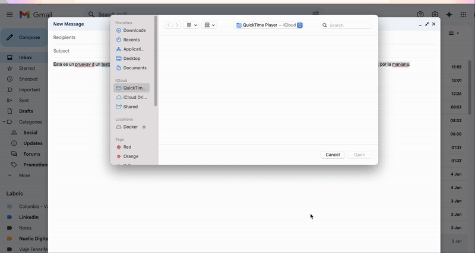

# Mejorar Texto en cualquier applicación con LLM

Este proyecto está diseñado para facilitar la corrección automática de texto usando un modelo de lenguaje (LLM) en cualquier aplicación que uses. 

Con este script, no necesitarás copiar y pegar manualmente el texto en ChatGPT. Solo necesitas configurar el script en Raycast y podrás disfrutar de correcciones inmediatas usando el atajo del teclado.

También puedes configurarlo para hacer oneshot del modelo en cualquier lugar, no solamente corrige texto, le puedes pasar cualquier instrucción y te responderá.

## Requisitos

Antes de comenzar, asegúrate de tener los siguientes elementos:

- **Python 3**: Necesario para ejecutar el script. [Página oficial de Python](https://www.python.org/downloads/).
- **Raycast**: Una herramienta de productividad para MAC.[ sitio web](https://www.raycast.com/).
- **Clave API de OpenAI**: Llave de acceso para ejecutar el LLM. [API KEY](https://platform.openai.com/account/api-keys).
  

## Instalación

Sigue los pasos a continuación para configurar el entorno y habilitar la ejecución del script:

1. **Instala Raycast**: 
   - Raycast es una herramienta que mejora tu productividad en el Mac. [sitio web](https://www.raycast.com/).

2. **Importa el Script a Raycast**:
   - Descarga el script proporcionado en este repositorio.
   - Una vez que Raycast esté instalado, abre la aplicación.
   - Ve a la sección de scripts y añade un directorio con el script que has descargado.
   
3. **Configura las Claves API**:
   - Obtén tu clave de API de OpenAI desde su plataforma.
   - Dentro del script que has copiado, reemplaza el marcador de posición correspondiente con tu clave de API de OpenAI.

4. **Asignación de Atajo de Teclado**:
   - En Raycast, establece un atajo de teclado que te permita ejecutar el script fácilmente. Esto te permitirá corregir texto con solo presionar unas teclas combinadas, sin interrumpir tu flujo de trabajo.

## Uso

Una vez configurado, puedes usar el script en cualquier aplicación que permita la selección de texto. Simplemente selecciona el texto que deseas corregir y usa el atajo de teclado que configuraste en Raycast. El script copiará el texto, lo corregirá usando el API de OpenAI y luego pegará el texto corregido en su lugar.

El modelo que estoy usando es GPT-4 mini, este es el mejor para corregir y hacer textos de manera barata, aunque si fuera solo para corregir textos se podría usar perfectamente Gemini Flash 8B ya que el precio es la mitad de barato.

Igual podrías cambiar el script para usar Claude Haiku o Sonnet 3.5, o cualquier modelo de lenguaje que quisieras. Esto te da mucha flexibilidad para hacer lo que quieras; incluso podrías llamar a la API de asistentes de OPENAI para llamar a tu propio GPT con un atajo del teclado.

## Conclusión

Este script automatiza un proceso que de otro modo requeriría múltiples pasos manuales, en definitiva, ahorrándote tiempo y esfuerzo. Ahora puedes disfrutar de correcciones ortográficas y gramaticales fluidas y sin complicaciones con solo un atajo de teclado.

Esto es lo que debería de estar pasando con Apple Intelligence con modelos de lenguaje ejecutados en local. Esta implementación también se podría usar con un modelo de lenguaje local como Mistral, cualquier modelo pequeño de Meta como Llama 2, o cualquier modelo de lenguaje de código abierto. La cuestión es que tendríamos que automatizar cargar el modelo o que siempre estuviera cargado en memoria, para que se ejecutara de manera rápida. Aunque es probablemente la opción más barata, requiere de más preparación y configuración. ¡Pero es una opción viable!

Probablemente implementen pronto Apple Intelligence, que hará lo mismo.

## Autor

- **Alejandro Tinto**  
  Puedes ver más sobre mi en [LinkedIn](https://www.linkedin.com/in/alejandro-tinto/) [Youtube](https://www.youtube.com/@alet1nto)